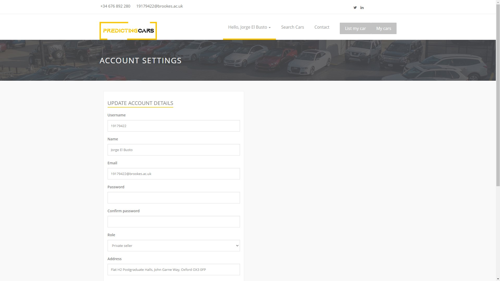

# PredictingCars

> Jorge El Busto - 19179422 - Oxford Brookes University
> 

---

## Abstract

Establishing a price when it comes to selling a car is not an easy task. If the user lacks expertise in this field and does not know which attributes to consider when estimating his/her car’s price, the risk of getting scammed can drastically increase. This project aims to develop a safe, robust application that helps users predict their cars’ prices.

A regression model will be trained in the back end of the application to make sure that the seller lists his/her car for the fairest possible price. To achieve the best balance between accuracy and computational time, a comparative study between multiple linear regression (MLR) and support vector regression (SVR) has been conducted.

Additionally, the application has been provided with features that noticeably improve its strength and security, such as load balancing and high availability with Docker and Kubernetes, two-factor authentication with Google Authenticator, traffic encryption with OpenSSL, and secret keys encryption with Libsodium.

Concerning the comparative study, logarithmic transformation and label encoding has been applied before training both MLR and SVR models. The mean average error and the mean squared error of both algorithms, along with the correlation coefficients, have been measured in different scenarios with datasets of 1,000, 90,000 and 400,000 instances.

To sum up, it had previously been found that SVR can significantly outperform MLR when it comes to handling datasets with larger numbers of instances. Nevertheless, throughout this study, adequate data pre-processing steps have led MLR to match the performance of SVR with a dataset of 400,000 cars, requiring MLR significantly less time than SVR.

---

## Download the application

The application can be tested in the following link. Once the application has been opened on a mobile device, click on “Options” and then “Add to home screen”. 

[PredictingCars](https://predictingcars.herokuapp.com/)


---

## Screenshots


.jpg)





---

## System design and architecture


---

## Data Science

The linear regression model used to make the predictions can be found in the [regression.py](https://github.com/bu5to/19179422_CarDealership/blob/main/regression.py) file. 

### Measuring the time elapsed, the MAE and the MSE of the algorithms

The snippet of code below can be helpful if the time taken to measure the algorithms is intended to be measured. Moreover, below, the way the MAE and the MSE have been retrieved is included. This snippet of code below must be run from Python IDLE.

```python
import pandas as pd
import numpy as np
from sklearn.preprocessing import LabelEncoder, OneHotEncoder, StandardScaler
from sklearn.model_selection import train_test_split
from sklearn.linear_model import LinearRegression
import seaborn as sns
import statsmodels.api as sm
from sklearn.metrics import mean_squared_error
import scipy.stats
from sklearn.svm import SVR
from sklearn.preprocessing import StandardScaler
from datetime import datetime

df = pd.read_csv("resources/carsWithLabels.csv", sep=';')
df = df.drop(columns="make")
df = df.drop(columns="model")
df = df.drop(columns="fuelType")
df = df.drop(columns="transmission")
df['log_price'] = np.log(df['price']) #Applying logarithmic transformation
df = df.drop(columns="price")
y = df['log_price']
X = df.loc[:, df.columns != 'log_price']
regr = LinearRegression()
X_train, X_test, y_train, y_test = train_test_split(X, y, test_size=0.2, random_state=0)
beforeRegr = datetime.now()
regr = regr.fit(X_train, y_train)
afterRegr = datetime.now()
timeRegr = afterRegr - beforeRegr
with open("results.txt", "a") as file:
    file.write("Results of MLR: " + str(timeRegr))
beforeSVRRBF = datetime.now()
regressor_SVR_rbf = SVR(kernel='rbf')
regressor_SVR_rbf = regressor_SVR_rbf.fit(X_train,y_train)
afterSVRRBF = datetime.now()
timeSVRRBF = afterSVRRBF - beforeSVRRBF
with open("results.txt", "a") as file:
   file.write("Results of SVR with RBF kernel: " + str(timeSVRRBF))
beforeSVRpoly = datetime.now()
regressor_SVR_poly = SVR(kernel='poly')
regressor_SVR_poly = regressor_SVR_poly.fit(X_train,y_train)
afterSVRpoly = datetime.now()
timeSVRpoly = afterSVRpoly - beforeSVRpoly
with open("results.txt", "a") as file:
    file.write("Results of SVR with polynomial kernel: " + str(timeSVRpoly))
beforeSVRlinear = datetime.now()
regressor_SVR_linear = SVR(kernel='linear')
regressor_SVR_linear = regressor_SVR_linear.fit(X_train,y_train)
afterSVRlinear = datetime.now()
timeSVRlinear = afterSVRlinear - beforeSVRlinear
with open("results.txt", "a") as file:
    file.write("Results of SVR with linear kernel: " + str(timeSVRlinear))

#--------------- MEASURING THE MAE AND THE MSE -----------------------------

def getPredictedValues(df, regr):
    predictedValues = []
    for index, row in df.iterrows():
        x = [row["year"], row["mileage"], row["tax"], row["engineSize"],
                 row["co2_emissions"], row["make_label"], row["model_label"], row["fuel_type_label"], row["transmission_label"]]
        prediction = regr.predict([x])
        predictedValues.append(prediction)
    return predictedValues

realPrices = y_sample.to_numpy()
predPrices = getPredictedValues(X_sample, regr)
predPricesSVR = getPredictedValues(X_sample, regressor_SVR_rbf)
predPricesSVRPoly = getPredictedValues(X_test, regressor_SVR_poly)
predPricesSVRLinear = getPredictedValues(X_test, regressor_SVR_linear)
predValues = []
realValues = []
predValuesSVR = []
predValuesSVRPoly = []
predValuesSVRLinear = []

for x in predPrices:
    predValues.append(x[0])
for x in realPrices:
    realValues.append(x)
for x in predPricesSVR:
    predValuesSVR.append(x[0])
for x in predPricesSVRPoly:
    predValuesSVRPoly.append(x[0])
for x in predPricesSVRLinear:
    predValuesSVRLinear.append(x[0])

def mae(y_true, predictions):
    y_true, predictions = np.array(y_true), np.array(predictions)
    return np.mean(np.abs(y_true - predictions))

mae_mlr = mae(realValues, predValues)
mse_mlr = mean_squared_error(realValues, predValues)

mae_svr = mae(realValues, predValuesSVR)
mse_svr = mean_squared_error(realValues, predValuesSVR)

mae_svr_poly = mae(realValues, predValuesSVRPoly)
mse_svr_poly = mean_squared_error(realValues, predValuesSVRPoly)

mae_svr_linear = mae(realValues, predValuesSVRLinear)
mse_svr_linear = mean_squared_error(realValues, predValuesSVRLinear)

#-----------RUNNING AND PLOTTING THE PRINCIPAL COMPONENT REGRESSION----------
X_train_scaled = scale(X_train)
X_test_scaled = scale(X_test)

for i in range(1, X_train_pc.shape[1]+1):
    rmse_score = -1 * cross_val_score(lin_reg,
                                      X_train_pc[:,:i], # Use first k principal components
                                      y_train,
                                      cv=cv,
                                      scoring='neg_root_mean_squared_error').mean()
    rmse_list.append(rmse_score)

plt.plot(rmse_list, '-o')
plt.xlabel('Number of principal components in regression')
plt.ylabel('RMSE')
plt.title('Quality')
plt.xlim(xmin=-1)
plt.xticks(np.arange(X_train_pc.shape[1]), np.arange(1, X_train_pc.shape[1]+1))
plt.axhline(y=lr_score_train, color='g', linestyle='-')
plt.show()
```

---

## Test report

| Test | Description | Precondition | Expected outcome | Pass or fail? |
| --- | --- | --- | --- | --- |
| test_register | The requirement  QR-PE-01 is tested. After having submitted the form, the registration process should not take longer than 5 seconds. | The client is up and running, both Mongo and Postgres databases are up and running, and the user has not been
registered before. | The difference between the
timestamps recorded before
and after the request should be
less than 3 seconds. The
response to the request should
have the status code of 200,
which means OK. | Pass |
| test_login | The requirement QR-PE-02 is
tested. The logging-in process should not take longer than 2
seconds. Throughout this test, a
mock user is registered in order
to, later, log in. | The client is up and running,
both Mongo and Postgres databases are up and running,
and the user has already been
registered. | The difference between the
timestamps recorded before and after the request should be
less than 2 seconds. The
response to the request should
have the status code of 200,
which means OK. | Pass |
| test_image_encoding | In this test, the quality
requirement QR-PE-03 is
tested. The process of encoding
an uploaded image to a Base64
string should not take more than
2 seconds. | The image file to be encoded
already exists in the project file
system. | The difference between the
timestamps recorded before
and after encoding the image
should be less than 2 seconds.
The returned encoded string
should be valid and not empty. | Pass |
| test_image_decoding | In this test, the compliance with
quality requirement QR-PE-04
is tested. The Base64 string
containing the image will be
decompressed when displaying
the image in the front end. This
process of painting the image in
the front end should take less
than 3 seconds. | The ID of the user whose image
is intended to be decoded
already exists in the database.
The user has a profile picture
assigned to him/her. | The difference between the
timestamps recorded before
and after having performed the
request to return the image in
the front end should be less
than 3 seconds. The response
for the request should have the
status code of 200, which
means OK. | Pass |
| test_custom_search | In this test, the quality
requirement QR-PE-05 is
tested. A POST request is made
in order to return the expected results for a search given certain parameters. This image searching process should be
successful and should not take
longer than 5 seconds. | The application server and the
Mongo database should be up
and running. | The difference between the
timestamps recorded before
and after the request should be
less than 5 seconds. The response for the request should
have the status code of 200,
which means OK. | Pass |
| test_alterAd | In this test, the quality requirement QR-PE-07 is tested. A mock car is listed on the website, and then, from a
POST request, some information on the car is requested to be changed. This
process of changing information
in the advertisement should not
take longer than 2 seconds. | The application server, the
Postgres database and the Mongo database should be up
and running. | The difference between the
timestamps recorded before
and after the request should be
less than 2 seconds. The
response for the request should
have the status code of 200,
which means OK. | Pass |
| test_deleteAd | In this test, the quality requirement QR-PE-06 is tested. The process of deleting
an advertisement should not take longer than two seconds. | The car intended to be deleted
already exists in the database.
The server, the MongoDB
database and the Postgres
database are up and running. | The difference between the
timestamps recorded before
and after the request should be
less than 2 seconds. The
response for the request should
have the status code of 200,
which means OK. | Pass |
| test_carMatchesId | This test is run to verify that the
method GetCarById returns the expected car given a certain ID. | The car searched for already exists in the database. The Mongo database is up and
running. | The ID of the retrieved car
matches the ID that has been passed as an input. | Pass |
| test_carMatchesMake | This test is run to verify that the
method GetCarByAttribute
returns the expected list of cars given a certain make. | There is at least one car with
the specified make in the database. The Mongo database
is up and running. | The make of every car on the
list matches the make that has
been passed as input. | Pass |
| test_carMatchesModel | This test is run to verify that the
method GetCarByAttribute
returns the expected list of cars given a certain model. | There is at least one car with
the specified model in the
database. The Mongo database
is up and running. | The model of every car on the
list matches the model that has
been passed as input. | Pass |
| test_carMatchesFuelType | This test is run to verify that the
method GetCarByAttribute
returns the expected list of cars given a certain fuel type. | There is at least one car with
the specified fuel type in the
database. The Mongo database
is up and running. | The fuel type of every car on the
list matches the fuel type that
has been passed as an input. | Pass |
| test_carMatchesPriceRange | This test is run to verify that the
method GetCarByAttribute
returns the expected list of cars given two inputs that serve as
the boundaries of a price range. | There is at least one car within
the specified price range in the
database. The Mongo database
is up and running. | All the cars returned in the list
have got a price between the
previously specified values. | Pass |
| test_carMatchesYearRange | This test is run to verify that the
method GetCarByAttribute
returns the expected list of cars given two inputs that serve as the boundaries of a year range. | There is at least one car within
the specified year range in the
database. The Mongo database
is up and running. | All the cars returned in the list
were built in a year between the
previously specified values. | Pass |
| test_carMatchesMilesRange | This test is run to verify that the
method GetCarByAttribute
returns the expected list of cars given two inputs that serve as
the boundaries of a mileage range. | There is at least one car within
the specified mileage range in
the database. The Mongo database is up and running. | All the cars returned in the list
have got a mileage between the
previously specified values. | Pass |
| test_user_email | The test is run to verify that the retrieved user given a certain
email matches the expected user. | The user searched for already exists in the database. The Postgres database is up and running. | The email of the retrieved user
matches the specified input. | Pass |
| test_username | The test is run to verify that the retrieved user given a certain username matches the expected user. | The user searched for already exists in the database. The Postgres database is up and running. | The username of the retrieved
user matches the specified
input. | Pass |